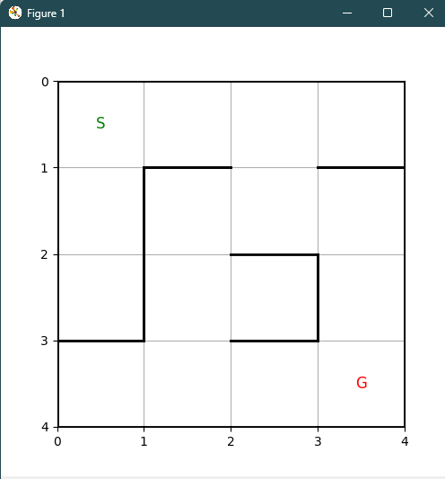

# 🧠 Micromouse Maze Simulator with Reinforcement Learning

This project is a **Python-based maze simulator** that uses **Q-learning**, a Reinforcement Learning (RL) technique, to train a virtual agent (micromouse in this case) to navigate a **wall-based maze**. Inspired by real-world Micromouse competitions, this tool helps visualize how an autonomous bot can learn and solve mazes over time.

---

## 🧰 Libraries Used

| Library      | Purpose                                     |
| ------------ | ------------------------------------------- |
| `matplotlib` | Visualization and animation                 |
| `numpy`      | Array and matrix operations                 |
| `random`     | Action selection and environment randomness |

Install dependencies (if not already installed):

```bash
pip install matplotlib numpy
```

---

## 🗂️ Project Structure

```
📁 micromouse-maze-simulator/
├── maze.py        # Main script with RL logic and visualization
└── README.md      # This file
└── previews
    ├── maze-preview.png
    └── maze-working.mp4
```

---

## 🏁 Maze Configuration

* The maze is represented using a list of wall definitions per cell:
  `[Top, Right, Bottom, Left]`, where `1 = wall`, `0 = open`.
* Fixed 4x4 maze currently defined (customizable).
* The RL agent receives:

  * `+10` reward for reaching the goal
  * `-1` for each valid move
  * `-5` penalty for attempting to walk into a wall

---

## 🎮 How to Run

1. Clone this repository:

```bash
git clone https://github.com/sriyaaaaapk/micromouse-maze-simulator.git
cd micromouse-maze-simulator
```

2. Run the simulation:

```bash
python maze.py
```

3. Watch the mouse learn & navigate! The path is animated after training.

---

## ✅ Current Capabilities

* ✔️ Q-learning training loop
* ✔️ Animated movement through maze
* ✔️ Wall-based collision checks with a fixed maze layout 
* ✔️ Path visualization with Start and Goal markers

---



[Click to watch the full simulation](previews/maze-working.mp4)
